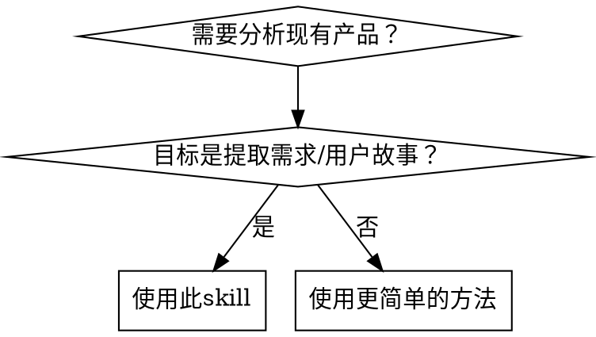

# 产品逆向分析

## 概述

系统化地分析现有产品，提取结构化的需求文档、用户故事和业务场景。这不是简单的"查看页面"，而是一种方法论，用于理解功能为什么存在（WHY）、如何工作（HOW）以及解决什么业务问题（WHAT）。

**核心原则**：深度产品分析需要自动化工具 + 结构化思维。仅靠手动浏览是不够的。

## 快速开始

**5分钟完成一个页面的快速分析**：

```bash
# 1. 获取内容概览
mcp__web_reader__webReader(url)

# 2. 查看页面结构
browser_snapshot()

# 3. 问自己三个问题
#    - 这个功能给谁用？
#    - 解决什么痛点？
#    - 如何变现/获客/留存？

# 4. 输出结构化笔记
```

详细完整分析请参考下方"分步方法"。

## 使用场景



**适用于**：
- 竞品分析
- 跨赛道功能迁移
- 产品设计学习
- 从现有产品反推PRD/用户故事

**不适用于**：
- 简单的截图描述
- 基础的页面导航帮助
- 非产品类URL（文档、文章）

## 分析框架

### 三层分析模型

```
第1层：表层（是什么 What）
├── UI组件与布局
├── 可见功能
└── 导航结构

第2层：交互层（怎么做 How）
├── 用户流程与工作流
├── 状态变化与反馈
└── 数据流与API调用

第3层：意图层（为什么 Why）
├── 解决的业务问题
├── 用户画像与场景
└── 设计决策与权衡
```

### 关键原则：不要跳过层级

大多数分析只停留在第1层。本skill要求深入分析。

**分析太浅的症状**：
- "这个页面有个登录按钮" ← 仅第1层
- 更好："用户必须通过身份验证才能访问个性化内容" ← 第2层
- 最佳："身份验证实现了数据持久化和跨设备同步，服务于[特定用户场景]" ← 第3层

## 快速参考：工具选择

| 分析目标 | 主要工具 | 为什么 |
|---------|---------|--------|
| 页面结构与UI | `browser_snapshot` | 可访问性树 > 截图 |
| 交互流程 | `browser_click`, `browser_type` | 测试实际行为 |
| 网络/API分析 | `browser_network_requests` | 理解数据流 |
| 技术栈检测 | `browser_evaluate` | 在页面上下文执行JS |
| 文本内容 | `mcp__web_reader__webReader` | 干净的markdown输出 |

**规则**：先用 `web_reader` 获取概览，再用 `browser_snapshot` 进行交互分析。

## 分步方法

### 阶段1：初始发现（5-10分钟）

**目标**：理解产品范围和结构

1. **快速内容扫描**
   ```bash
   # 使用web_reader快速提取内容
   mcp__web_reader__webReader(url)
   ```

2. **导航结构提取**
   ```bash
   # 获取可访问性快照
   browser_snapshot()
   # 提取导航链接和页面结构
   ```

3. **技术栈检测**
   ```javascript
   // 在页面上下文中执行browser_evaluate
   () => {
     const frameworks = [];
     if (window.React || window._reactRootContainer) frameworks.push('React');
     if (window.Vue || document.querySelector('[data-v-]')) frameworks.push('Vue');
     if (window.angular) frameworks.push('Angular');
     if (document.querySelector('[class*="ant-"]')) frameworks.push('Ant Design');
     if (window.__NUXT__) frameworks.push('Nuxt');
     if (window.__NEXT_DATA__) frameworks.push('Next.js');

     return {
       frameworks: frameworks,
       uiLibs: [...new Set([...document.querySelectorAll('[class]')].map(el => {
         const match = el.className.match(/(ant-|mui-|chakra-|tailwind)/);
         return match ? match[0] : null;
       }).filter(Boolean))].slice(0, 5),
       stateMgmt: !!window.__REDUX_STORE__ || !!window.__VUE_DEVTOOLS_GLOBAL_HOOK__,
       buildTool: window.__NUXT__ ? 'Nuxt' : window.__NEXT_DATA__ ? 'Next.js' : 'Unknown'
     };
   }
   ```

**输出**：产品概览、主要模块、技术栈

---

### 阶段2：深度交互分析（15-30分钟）

**目标**：绘制用户流程和状态变化

1. **核心用户旅程演练**
   ```
   browser_navigate(url)
   browser_snapshot()  // 初始状态
   browser_click(element)  // 执行操作
   browser_snapshot()  // 新状态
   // 对比：发生了什么变化？
   ```

2. **表单与输入分析**
   ```
   browser_fill_form(fields)
   // 观察验证规则、错误状态
   ```

3. **网络监控**
   ```
   browser_network_requests()
   // 调用了哪些API？
   // 发送/接收了什么数据？
   ```

**输出**：用户流程、状态图、API契约

---

### 阶段3：业务逻辑提取（10-20分钟）

**目标**：理解功能为什么存在

针对每个主要功能，回答：

1. **用户画像**：这是给谁用的？
   - 证据：基于角色的UI、权限差异、术语使用

2. **解决的问题**：什么痛点？
   - 证据：功能定位、文案、用户评价

3. **商业价值**：为什么企业提供这个功能？
   - 证据：变现方式、留存、获客

4. **设计权衡**：放弃了哪些替代方案？
   - 证据：限制、约束、变通方案

**输出**：用户故事、业务场景、设计理由

---

### 阶段4：文档合成（10-15分钟）

**目标**：生成结构化文档

#### PRD模板
```markdown
# 产品需求文档

## 产品概述
- **定位**：[解决什么问题？]
- **目标用户**：[给谁用？]
- **核心价值**：[为什么选择这个而非替代方案？]

## 功能模块

### 模块名称
- **描述**：[做什么]
- **优先级**：P0/P1/P2
- **用户价值**：[用户为什么在意]
- **技术复杂度**：低/中/高
- **依赖**：[需要什么]

## 非功能性需求
- 性能：[具体指标]
- 安全：[认证、数据保护]
- 可扩展性：[用户量处理能力]
```

#### 用户故事模板
```markdown
# 用户故事

## [用户角色]

### US-XXX：[功能名称]
**作为** [用户角色]
**我希望** [具体功能]
**以便** [业务价值]

**验收标准**：
- [ ] 给定 [上下文]，当 [操作]，则 [结果]
- [ ] [边界情况处理]

**优先级**：P0/P1/P2
**依赖**：US-XXX
**复杂度**：故事点
```

#### 完整输出示例

```markdown
# AIBase 产品逆向分析

## 产品概述
- **定位**：AI行业一站式信息枢纽
- **目标用户**：AI从业者(40%)、开发者(30%)、创作者(15%)
- **核心价值**：聚合AI资讯、工具、模型，降低发现成本
- **用户规模**：850,000+ 用户，1,980,000+ PV/月

## 商业模式
**免费+订阅转化+企业服务** 三层漏斗：
1. 资讯板块 → 驱动流量和SEO
2. 工具库/模型广场 → 诱导注册 (28,000+ 订阅)
3. 企业服务/CPS佣金 → 最终变现

## 功能模块分析

### 1. 资讯聚合 (P0 - 流量引擎)
- **用户价值**：一站式获取AI行业动态，无需多站浏览
- **技术实现**：自动抓取+人工审核，RSS订阅
- **商业价值**：SEO流量入口，日均95,000+资讯

### 2. 工具库导航 (P0 - 注册诱饵)
- **用户价值**：发现和对比AI工具，按热度/评分筛选
- **技术实现**：用户提交+人工审核，流量排名算法
- **商业价值**：CPS佣金分成，引导注册

### 3. 模型广场 (P1 - 开发者留存)
- **用户价值**：对比大模型参数、价格、性能
- **用户画像**：AI开发者、技术决策者
- **商业价值**：企业服务引流，API返佣

## 用户故事示例

### US-001: 工具发现
**作为** AI从业者
**我希望** 快速找到最新最热的AI工具
**以便** 保持竞争力并应用到工作中

**验收标准**：
- [x] 支持按分类/热度/评分筛选
- [x] 显示工具简介和官网链接
- [x] 提供用户评价和使用案例

## 差异化机会
- 缺少社区互动 (评论、讨论)
- 个性化推荐能力弱
- 深度分析内容不足
```

## 常见错误

| 错误 | 为什么错 | 如何修正 |
|------|---------|---------|
| **仅用截图分析** | 图片无法显示行为和意图 | 使用 `browser_snapshot` 获取可访问性树 |
| **功能罗列无"为什么"** | 错过设计意图和业务逻辑 | 始终问："这解决了什么问题？" |
| **跳过交互测试** | 无法理解流程和状态 | 点击按钮、填写表单、观察变化 |
| **忽略网络层** | 错过数据流和后端逻辑 | 使用 `browser_network_requests` |
| **单维度分析** | 单次测试会遗漏边界情况 | 同时测试正常路径和错误情况 |
| **不思考工具选择** | 错误工具 = 低效或错误结果 | 参考快速参考表 |

## 实际效果对比

**使用此skill之前**：
- 分析："AIBase有资讯、工具和模型板块"
- 深度：表层功能列表
- 可操作性：低

**使用此skill之后**：
- 分析："AIBase是一个AI生态聚合器。资讯驱动流量，工具驱动发现，模型驱动开发者采用——每个漏斗都通过企业服务实现变现"
- 深度：商业模式、用户旅程、技术架构
- 可操作性：高——可战略性复制或竞争

## 常见问题

**Q: 需要登录的页面怎么分析？**
A: 可以先分析公开部分，再基于公开信息推断登录后的功能。如果需要，可使用 `browser_fill_form` 填写登录信息（注意账号安全）。

**Q: SPA（单页应用）怎么处理？**
A: 使用 `browser_wait_for` 等待动态内容加载，配合 `browser_snapshot` 确认内容已渲染完成。

**Q: 分析时间太长怎么办？**
A: 优先使用快速开始流程，仅聚焦核心功能。完整分析可以分多次进行。

**Q: 如何验证我的分析是否正确？**
A: 对比用户评价、App Store 评论、社交媒体讨论，看是否与你的推断一致。

**Q: 移动端应用能分析吗？**
A: 本技能主要针对 Web 产品。移动端可考虑模拟器或分析竞品的 Web 版本。

## 红旗警示——你做错了

- "我就截个图" ← 使用 `browser_snapshot`
- "这个功能是X" ← 补充"为Y用户，解决Z问题"
- "我不需要点击任何东西" ← 你怎么知道它有效？
- "网络请求不重要" ← 你错过了半壁江山
- "这只是个列表页" ← 列表解决了什么业务问题？

**所有这些意味着**：停下来。重读这个skill。再深入一点。

## 相关资源

- [三技能组合工作流](reference/three-skill-product-workflow.md) - 本技能 + business-analyst + prd-generator 完整产品开发流程
- [business-analyst 技能](https://github.com/aj-geddes/claude-code-bmad-skills) - 产品发现与需求分析
- [prd-generator 技能](https://github.com/aj-geddes/claude-code-bmad-skills) - 生成完整 PRD 文档
