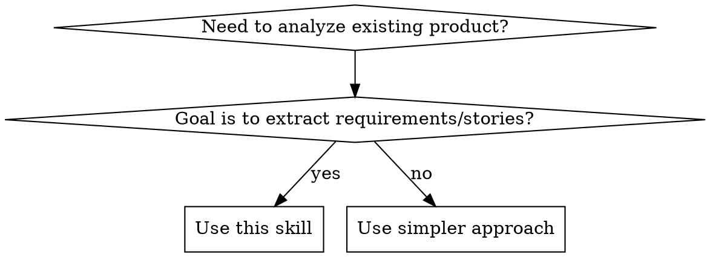

# Product Reverse Analysis

## Overview

Systematically analyze existing products to extract structured requirements, user stories, and business scenarios. This is NOT just "looking at a page"—it's a methodical approach to understanding WHY features exist, HOW they work, and WHAT business problems they solve.

**Core principle**: Deep product analysis requires automated tools + structured thinking. Manual browsing is insufficient.

## When to Use



**Use for**:
- Competitive analysis (竞品分析)
- Feature migration across domains (跨赛道功能迁移)
- Learning product design patterns (产品设计学习)
- Extracting PRD/user stories from existing products (反推需求文档)

**When NOT to use**:
- Simple screenshot description
- Basic page navigation help
- Non-product URLs (documents, articles)

## Analysis Framework

### The 3-Layer Analysis Model

```
Layer 1: Surface (What)
├── UI Components & Layout
├── Visible Features
└── Navigation Structure

Layer 2: Interaction (How)
├── User Flows & Workflows
├── State Changes & Feedback
└── Data Flow & API Calls

Layer 3: Intent (Why)
├── Business Problems Solved
├── User Personas & Scenarios
└── Design Decisions & Trade-offs
```

### Critical Dimension: Don't Skip Layers

Most analysis stops at Layer 1. This skill demands going deeper.

**Symptoms you stopped too early**:
- "This page has a login button" ← Layer 1 only
- Better: "Users must authenticate to access personalized content" ← Layer 2
- Best: "Authentication enables data persistence and cross-device sync for [specific user scenario]" ← Layer 3

## Quick Reference: Tool Selection

| Analysis Goal | Primary Tool | Why |
|--------------|--------------|-----|
| Page structure & UI | `browser_snapshot` | Accessibility tree > screenshots |
| Interactive flows | `browser_click`, `browser_type` | Test actual behavior |
| Network/API analysis | `browser_network_requests` | Understand data flow |
| Tech stack detection | `browser_evaluate` | Execute JS in page context |
| Text content | `mcp__web_reader__webReader` | Clean markdown output |

**Rule**: Start with `web_reader` for overview, then `browser_snapshot` for interaction analysis.

## Step-by-Step Method

### Phase 1: Initial Discovery (5-10 min)

**Goal**: Understand product scope and structure

1. **Quick content scan**
   ```bash
   # Use web_reader for fast content extraction
   mcp__web_reader__webReader(url)
   ```

2. **Navigation extraction**
   ```bash
   # Get accessibility snapshot
   browser_snapshot()
   # Extract nav links and page structure
   ```

3. **Tech stack detection**
   ```javascript
   // browser_evaluate in page context
   () => {
     return {
       frameworks: detectReactVueAngular(),
       uiLibs: detectUILibraries(),
       stateMgmt: detectStateManagement()
     }
   }
   ```

**Output**: Product overview, main modules, tech stack

---

### Phase 2: Deep Interaction Analysis (15-30 min)

**Goal**: Map user flows and state changes

1. **Core user journey walkthrough**
   ```
   browser_navigate(url)
   browser_snapshot()  // Initial state
   browser_click(element)  // Take action
   browser_snapshot()  // New state
   // Compare: What changed?
   ```

2. **Form & input analysis**
   ```
   browser_fill_form(fields)
   // Observe validation, error states
   ```

3. **Network monitoring**
   ```
   browser_network_requests()
   // What APIs are called?
   // What data is sent/received?
   ```

**Output**: User flows, state diagrams, API contracts

---

### Phase 3: Business Logic Extraction (10-20 min)

**Goal**: Understand WHY features exist

For each major feature, answer:

1. **User Persona**: Who is this for?
   - Evidence: Role-based UI, permission differences, terminology

2. **Problem Solved**: What pain point?
   - Evidence: Feature positioning, copy, user reviews

3. **Business Value**: Why does the business offer this?
   - Evidence: Monetization, retention, acquisition

4. **Design Trade-offs**: What alternatives were rejected?
   - Evidence: Limitations, constraints, workarounds

**Output**: User stories, business scenarios, design rationale

---

### Phase 4: Documentation Synthesis (10-15 min)

**Goal**: Generate structured artifacts

#### PRD Template
```markdown
# Product Requirements Document

## Product Overview
- **Positioning**: [What problem does it solve?]
- **Target Users**: [Who is it for?]
- **Core Value**: [Why choose this over alternatives?]

## Feature Modules

### Module Name
- **Description**: [What it does]
- **Priority**: P0/P1/P2
- **User Value**: [Why users care]
- **Tech Complexity**: Low/Medium/High
- **Dependencies**: [What it requires]

## Non-Functional Requirements
- Performance: [Specific metrics]
- Security: [Auth, data protection]
- Scalability: [User volume handling]
```

#### User Story Template
```markdown
# User Stories

## [User Role]

### US-XXX: [Feature Name]
**As a** [user role]
**I want** [specific feature]
**So that** [business value]

**Acceptance Criteria**:
- [ ] Given [context], When [action], Then [outcome]
- [ ] [Edge case handling]

**Priority**: P0/P1/P2
**Dependencies**: US-XXX
**Complexity**: Story Points
```

## Common Mistakes

| Mistake | Why It's Wrong | Fix |
|---------|----------------|-----|
| **Screenshot-only analysis** | Images don't show behavior or intent | Use `browser_snapshot` for accessibility tree |
| **Feature listing without "why"** | Misses design intent and business logic | Always ask: "What problem does this solve?" |
| **Skipping interaction testing** | Can't understand flows or states | Click buttons, fill forms, observe changes |
| **Ignoring network layer** | Miss data flow and backend logic | Use `browser_network_requests` |
| **One-dimensional analysis** | Single pass misses edge cases | Test both happy path and error cases |
| **No tool selection thinking** | Wrong tool = inefficient or wrong results | Consult Quick Reference table |

## Real-World Impact

**Before this skill**:
- Analysis: "AIBase has news, tools, and model sections"
- Depth: Surface-level feature list
- Actionability: Low

**After this skill**:
- Analysis: "AIBase is an AI ecosystem aggregator. News drives traffic, tools drive discovery, models drive developer adoption—each funnel leads to monetization via enterprise services"
- Depth: Business model, user journeys, technical architecture
- Actionability: High - can replicate or compete strategically

## Red Flags - You're Doing It Wrong

- "Let me just take a screenshot" ← Use `browser_snapshot`
- "This feature does X" ← Add "for Y user, to solve Z problem"
- "I don't need to click anything" ← How do you know it works?
- "Network requests don't matter" ← You're missing half the picture
- "This is just a listing page" ← What business problem does listing solve?

**All of these mean**: Stop. Re-read this skill. Go deeper.
